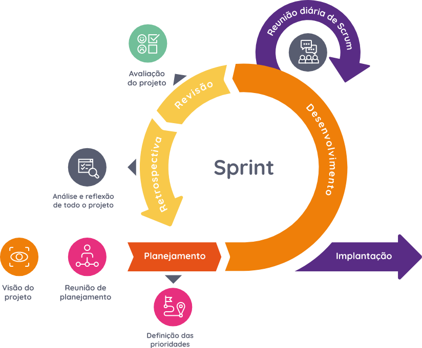

## Abordagem de Desenvolvimento de Software
### Metodologia ágil
#### Scrum

Escolhemos a metodologia ágil Scrum como base para o nosso projeto.
Utilizaremos os artefatos: product backlog, sprint backlog e um produto incremental possivelmente lançável.
Realizaremos os eventos: sprint, sprint planning, daily scrum, sprint review e sprint retrospective.
Ainda, utilizaremos a prática chave do XP Programming, a programação por pares (pair programming).
Também utilizaremos um quadro Kanban, para acompanhamento dos backlogs.
Também utilizaremos Lean Inception como ferramenta para alinhar o entendimento das áreas de negócio do produto entre a equipe.

## Referências Bibliográficas
> Abran, A., Moore, J., Bourque, P. and Dupuis, R. (Eds) (2004) SWEBOK: Guide to the Software Engineering Body of Knowledge. IEEE Computer Society

> Sommerville, I. (2011) Software Engineering, 9th edition. Addison-Wesley

## Versionamento

 Versão|Data      |Modificação        |Autor
-------|----------|-------------------|--------
1.0    |27/01/2022|Criação do conteúdo| José Guilherme
1.1    |02/02/2022|Adição do conteúdo | Mariana Rio
1.2    |03/02/2022|Adição do conteúdo | Mariana Rio

