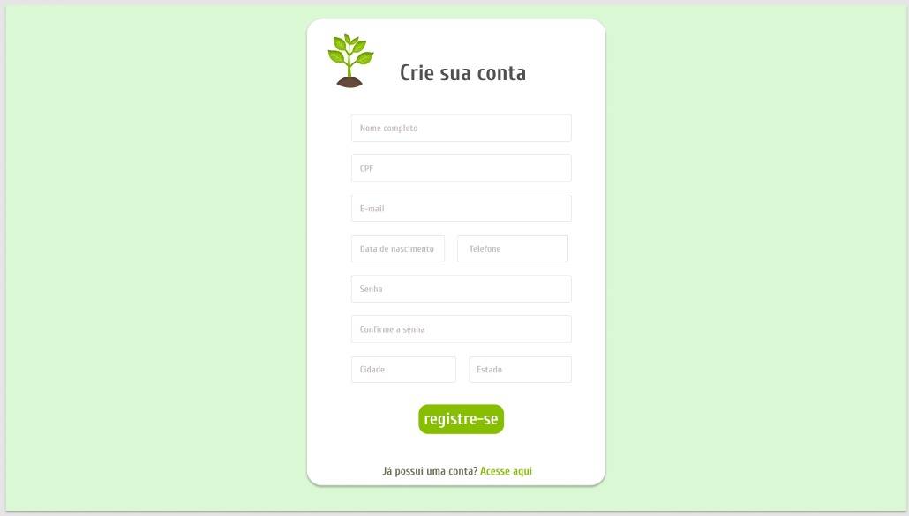
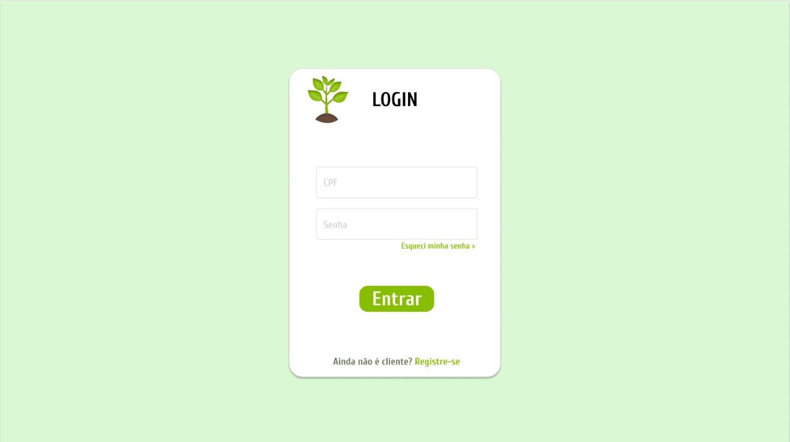

###  Epics

#### E01: Registro de Usuários
##### Features:

- RF01: O produtor se registra na plataforma
    - S01: O usuário a conta tipo produtor
    

    - S02: O produtor envia suas informações pessoais e de contato
    

    - S03: O produtor envia as informações da sua fazenda
    

- RF02: O cliente se registra na plataforma
    - S05: O usuário a conta tipo cliente
    

    - S04: O cliente envia suas informações pessoais e de contato
    

#### E02: Acesso de Usuários
##### Features:

- RF03: Usuário realiza login na plataforma
    - S05: O usuário informa CPF e senha
    

## Versionamento

 Versão|Data      |Modificação        |Autor
-------|----------|-------------------|--------
1.0    |04/04/2022|Criação da página  |Mariana Rio
1.1    |04/04/2022|Criação da conteudo|Felipe Augustini