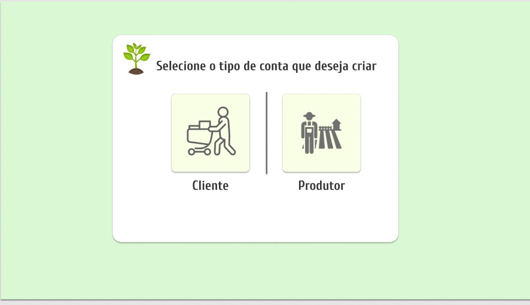
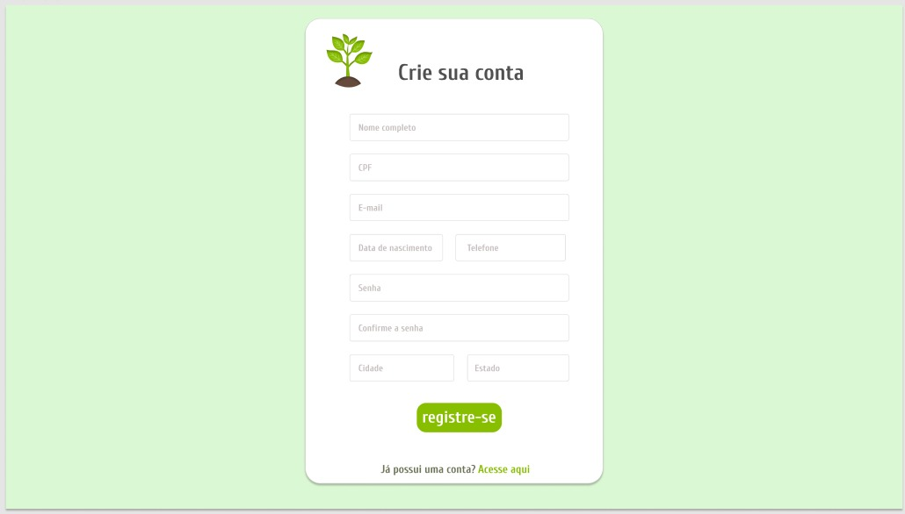
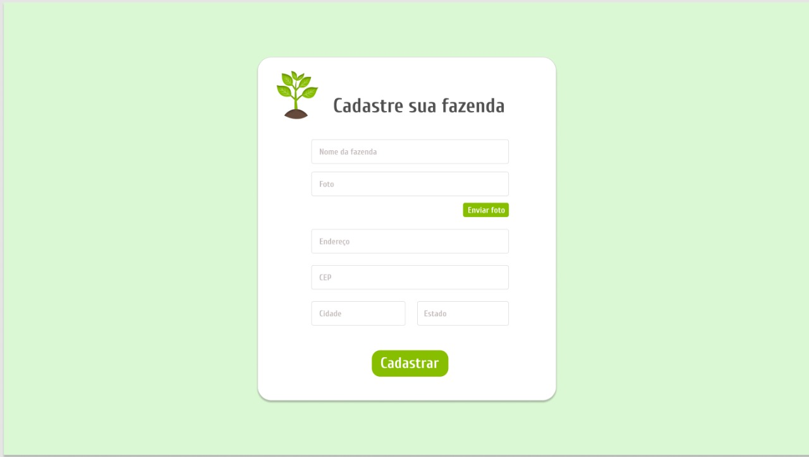
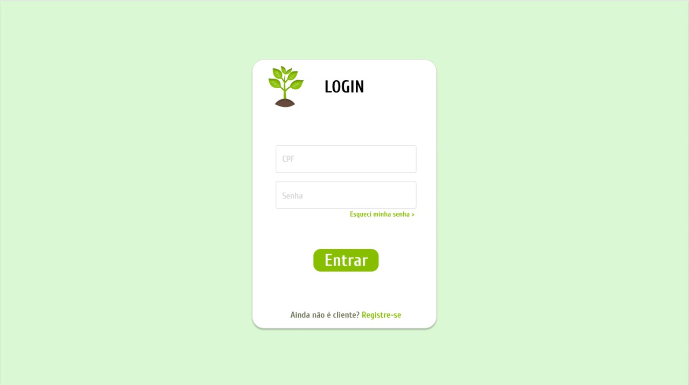

###  Epics

#### E01: Registro de Usuários
##### Features:

- RF01: Escolha de conta
    - S01: Eu como produtor desejo escolher a conta tipo produtor, para realizar um cadastro de produtor
    

    - S02: Eu como cliente desejo escolher a conta tipo cliente, para realizar um cadastro de cliente
    
- RF02: Criação de contas
    - S03: Eu como produtor desejo me cadastrar na plataforma para criar minha conta
    
    - S04: Eu como Cliente desejo me cadastrar na plataforma para criar minha conta
    
- RF03: Registro de fazenda
    - S05: Eu como produtor desejo cadastrar a minha fazenda na plataforma para finalizar minha conta
    
#### E02: Acesso de Usuários
##### Features:
- RF04: Acesso de conta
    - S06: Eu como produtor desejo acessar o site pela minha conta para anunciar meus produtos 
    

    - S07: Eu como cliente desejo acessar o site pela minha conta para comprar produtos
    

## Versionamento

 Versão|Data      |Modificação        |Autor
-------|----------|-------------------|--------
1.0    |04/04/2022|Criação da página  |Mariana Rio
1.1    |04/04/2022|Criação da conteudo|Felipe Augustini
1.2    |07/04/2022|Alteração da página  |Mariana Rio